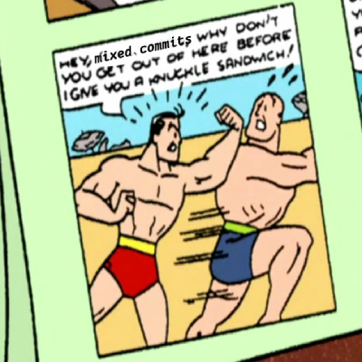

# hunky

**`git add -p` for agents and scripts.**

Oh, *mama.* You're an AI agent — or a script, or a CI job — and you just want to stage
*some* of a file's changes, like a civilized creature. So you reach for `git add -p` and...
it's an interactive TUI. You can't drive it. No hands, no keyboard, no party. The one git
operation a non-interactive caller can't do is the exact one you need. Sure is annoying.

If only some good-lookin' tool could stage *just the hunks you point at*, no TUI required.
*Hey there, pretty mama.* That's **hunky**: it parses the diff, rebuilds a clean patch from
the hunks — or even the individual lines — you select, and pipes it to `git apply --cached`.
Man, those are some pretty hunks.

<table>
  <tr>
    <td></td>
    <td></td>
    <td></td>
  </tr>
  <tr>
    <td></td>
    <td></td>
    <td></td>
  </tr>
</table>

Single-file Go, zero dependencies.

## Install

```sh
go install github.com/whiskeytuesday/hunky@latest
# or, from a checkout:
go build -o hunky .
```

## Usage

```
hunky --list <file>               list hunks with numbers and @@ headers
hunky --count <file>              print the number of hunks
hunky <file> <hunk>...            stage hunks by number (1-based)
hunky --invert <file> <hunk>...   stage every hunk EXCEPT the listed ones
hunky --lines START-END <file>    stage whole hunks overlapping a line range
hunky --pick-lines A-B <file>     stage only the +/- lines within A-B (splits a hunk)
hunky --dry-run <file> <hunk>...  print the patch instead of staging
hunky --stdin <file> <hunk>...    read the diff from stdin instead of `git diff`
```

By default it reads `git diff HEAD -- <file>` (HEAD vs working tree). With `--stdin` it
reads a diff you provide — and if that diff spans multiple files, the `<file>` arg selects
which one to operate on.

### The reliable loop

```sh
hunky --list f.go          # 1. see numbered hunks
hunky --dry-run f.go 4     # 2. PREVIEW the exact patch (don't skip this)
hunky f.go 4               # 3. stage just those hunks
git diff --cached --stat   # 4. confirm what landed
git commit -m "..."        # 5. the leftover hunks are the next commit
```

Step 2 matters: a hunk header (`@@ -1017,7 …`) tells you *where* but not *what* — a
one-line fix can hide between feature hunks. The dry-run shows the actual `+`/`-` lines.

### Splitting a single hunk: `--pick-lines`

When two unrelated changes land in one hunk with **no unchanged line between them**,
whole-hunk selection can't separate them. `--pick-lines A-B` reconstructs the hunk keeping
only the `+`/`-` lines whose worktree line numbers fall in `A-B` (dropping other additions,
demoting other deletions to context):

```sh
# stage one changelog entry out of an adjacent pair of new entries
hunky --pick-lines 25-37 CHANGELOG.md
```

### Staging everything but a few hunks: `--invert`

When most of a file is one concern and only a hunk or two are separate, name the few and
invert — cheaper than listing all the rest:

```sh
hunky --count f.go            # how many hunks are there?
hunky --invert f.go 4         # stage all of them except hunk 4
```

## How it works

It parses `git diff`, reconstructs a valid unified patch from the selected hunks/lines, and
pipes it to `git apply --cached`. It never does string-replace surgery on patch bodies, so
literal text that looks like sed backrefs or special characters passes through untouched.

## The one gotcha: hunk numbers are stable until you commit

The tool diffs HEAD vs the **working tree**, so the index already reflects what you've
staged. Therefore:

- **Staging more hunks does *not* renumber.** `--list` once, then stage `1 3 5` and later
  `2 4` against the same numbering.
- **Committing *does* renumber** — committed changes leave the HEAD-vs-worktree diff, so the
  next `--list` starts at 1 with only what's left. (`invalid hunk number 5 (have 4 hunks)`
  means you reused stale numbers after a commit.)

Rule of thumb: **one `--list` per commit.**

## Limitations

- **One file per invocation.** Multi-file diffs *parse* correctly and the `<file>` arg
  selects one, but each run operates on a single file.
- **Base is always `git diff HEAD`.** There's no `--base <ref>` mode — and on purpose:
  the staged patch is applied to the *index* with `git apply --cached`, so a base other
  than HEAD would fail to apply wherever the index and that base already diverge.
- Quoted paths containing spaces (rare) aren't matched by the `<file>` selector.

## License

MIT — see [LICENSE](LICENSE).
